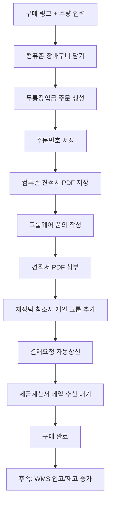

# Purchase_Auto 1차 프로세스

## Scope

1차 범위는 `컴퓨존 무통장 주문 생성 + 견적서 PDF 확보 + 그룹웨어 품의 자동상신`입니다.

WMS 저재고 추천, WMS 구매 버튼, 입고 확정, 재고 증가는 세금계산서 수신 이후 완료 상태가 안정적으로 잡힌 뒤 후속 연동으로 붙입니다.

## Correct Flow

## Groupware Rules

| 법인 | 양식 | 참조자 개인 그룹 |
| --- | --- | --- |
| 대승 | 대승 - (관리총괄)기안용지(관리직) | 재정_대승 |
| 대승정밀 | 대승정밀 - (관리총괄)기안용지(관리직) | 재정_대승정밀 |
| 일강 | 일강 - (경영)기안용지 | 재정_일강 |

사진 기준 UI는 `결재 정보 -> 참조자 -> 개인 그룹 -> 재정_* 그룹 선택 -> 확인`입니다.

## State Rules

- `created`: 사용자가 작업을 생성한 상태입니다.
- `order_submitted_pending_payment`: 컴퓨존 무통장입금 주문번호가 생성된 상태입니다.
- `quote_saved`: 주문번호 기반 컴퓨존 견적서 PDF가 저장된 상태입니다.
- `approval_submitted`: 그룹웨어 결재요청이 완료된 상태입니다.
- `waiting_tax_invoice`: 재정팀 입금 및 세금계산서 발행을 기다리는 상태입니다.
- `completed`: 세금계산서 수신 확인 후 구매 완료 처리된 상태입니다.
- `failed`: 자동화 실패 상태입니다.

품의 상신은 주문번호와 견적서 PDF가 모두 있어야만 가능합니다.

## Live Automation Guardrails

- 기본값은 드라이런입니다.
- 실제 컴퓨존 주문은 `PURCHASE_AUTO_ENABLE_LIVE_COMPUZONE_ORDER=1`을 켜야 합니다.
- 실제 그룹웨어 상신은 `PURCHASE_AUTO_ENABLE_LIVE_GROUPWARE_SUBMIT=1`을 켜야 합니다.
- 로그인 화면이 감지되면 자동 로그인하지 않고 실패 처리합니다.
- 계정/비밀번호는 저장소에 두지 않습니다.
